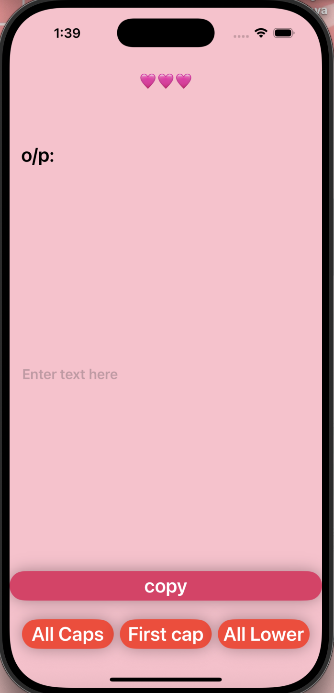

# CaseConverterApp
A simple Swift iOS app that lets users transform text to uppercase, lowercase, or capitalized format and copy the transformed text to the clipboard.
__Note:__ This project was created as a part of the course _iPhone Apps for Complete Beginners - Swift, SwiftUI & iOS17_ on Udemy, taught by Nick Walter.

## Features
- Enter any text in a text field  
- Transform text to:
  - All Caps 
  - First Letter Capitalized 
  - All Lowercase 
- Copy the transformed text to clipboard with a single tap

## How to Use
1. Type your text in the text field.  
2. Tap one of the buttons to transform the text.  
3. Press the **Copy** button to copy the transformed text to your clipboard.

## Screenshot 

